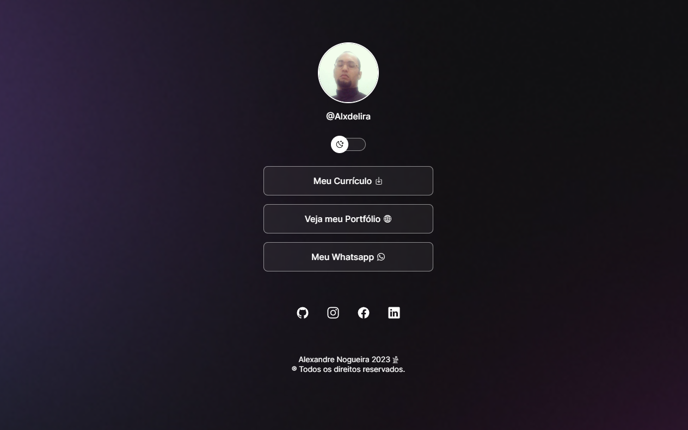

<h1 align="center">:file_cabinet: README.md</h1>

## :memo: Descrição
Projeto Voltado para Centralizar links e outros.

    

## :wrench: Tecnologias utilizadas
* Html
* Css
* Javascript

## :handshake: Colaboradores
<table>
  <tr>
    <td align="center">
      <a href="http://github.com/Alxdelira">
         
        
          <b>Alxdelira</b>
        
      </a>
    </td>
  </tr>
</table>
